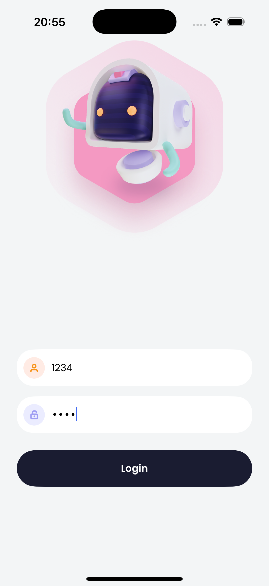
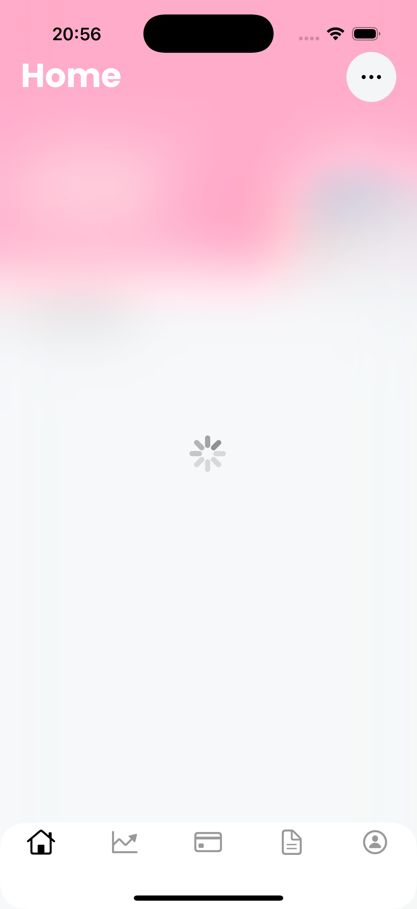
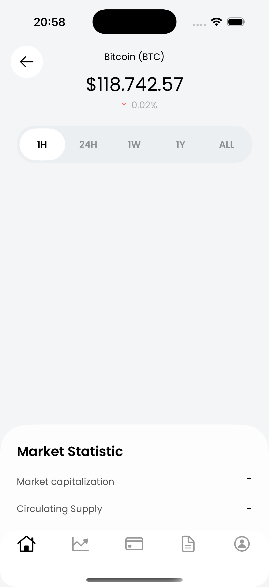
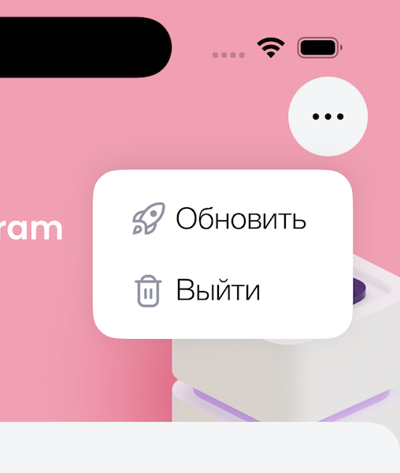
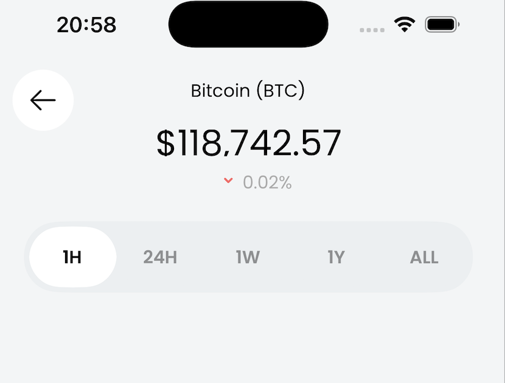
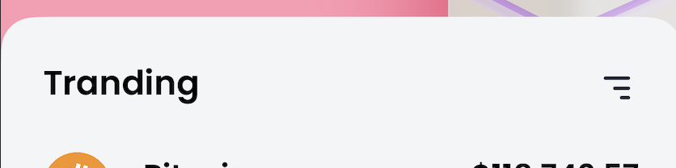
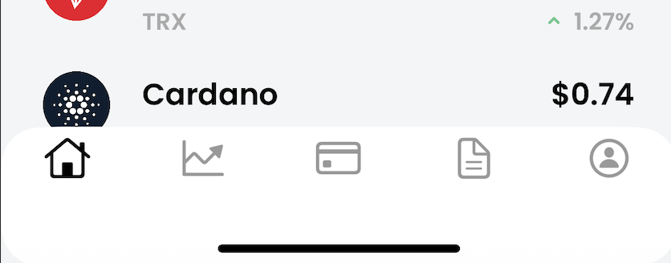
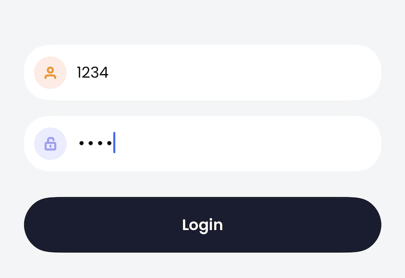
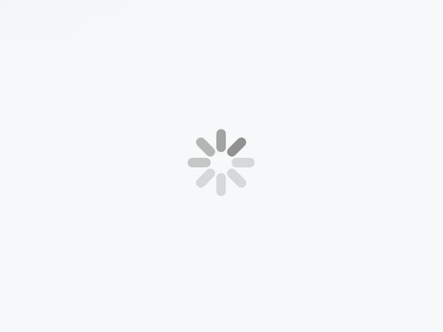

# CryptoWallet

## Описание

CryptoWallet — это начальное iOS-приложение, которое может быть использовано как полноценный крипто-кошелёк. 
В проекте на данный момент реализованы три экрана: авторизация, список монет и страница с детальной информацией по выбранной монетке.  
Приложение написано полностью на Swift, без Storyboard и XIB, с использованием SnapKit для верстки.  
Основной акцент сделан на чистую архитектуру, расширяемость и соответствие современным best practices.

---

## Сцены

  
  
  
  

---

## Элементы интерфейса

<table>
  <tr>
    <td align="center">
       
      <b>More Button</b>
    </td>
    <td align="center">
       
      <b>Segmenter and Back Button</b>
    </td>
  </tr>
  <tr>
    <td align="center">
       
      <b>Filter Button</b>
    </td>
    <td align="center">
       
      <b>TabBar</b>
    </td>
  </tr>
  <tr>
    <td align="center"
       
      <b>TextField</b>
    </td>
    <td align="center"
       
      <b>Spinner</b>
    </td>
  </tr>
</table>

---
## Архитектура и структура проекта

- **Архитектура:** MVVM (Model-View-ViewModel)  
  Подобный подход был выбран, чтобы разделить бизнес-логику, работу с данными и отображение информации. Это облегчает тестирование, поддержку и расширение проекта.
- **UI:**  
  - Верстка только через код (SnapKit).
  - Кастомные компоненты (NavigationBar, popupMenu и др.).
  - Адаптация под макет из Figma.
- **Навигация:**  
  - После авторизации происходит смена rootViewController, чтобы пользователь не мог вернуться к экрану логина свайпом.
  - Для переходов между экранами внутри приложения используется UINavigationController.
- **Сетевой слой:**  
  - Реализован через URLSession.
  - Единый сервис для работы с API Messari.
  - Используются Codable-модели для парсинга.
- **Хранение состояния:**  
  - Состояние авторизации хранится в UserDefaults через сервис AuthStorage.
  - При запуске приложения проверяется флаг авторизации и показывается нужный экран.
- **Обработка ошибок:**  
  - Для неверного логина/пароля показывается UIAlertController с двумя вариантами действий.
  - Для отсутствующих данных в API предусмотрены плейсхолдеры ("-").
- **Refresh и сортировка:**  
  - Кнопка "Обновить" вызывает повторную загрузку данных.
  - Кнопка сортировки меняет порядок монет по изменению цены (с анимацией поворота иконки).
- **UI/UX детали:**  
  - Индикатор загрузки (spinner) и blur-эффект на время обновления.
  - PopupMenu появляется с анимацией и не перекрывается другими элементами.
  - Все цвета и иконки берутся из Assets для легкой кастомизации.

---

## Ключевые решения

- **MVVM:**  
  Это облегчает поддержку и расширение проекта, позволяет легко тестировать ViewModel и переиспользовать бизнес-логику.
- **UserDefaults для хранения состояния:**  
  Используется в связи с простотой, имеет лищь два состояния: пользователь залогинен или нет.
- **Смена rootViewController после авторизации:**  
  Это предотвращает возврат к экрану логина случайным свайпом.
- **SnapKit для верстки:**  
  Позволяет быстро и декларативно описывать layout.
- **Работа с API Messari:**  
  Используются только нужные поля, монетки фильтруются по символам. Есть поле для расширения, так как данный API не содержит, к примеру, капитализации и некоторых тайм сегментов. Данные заменяются "-".

---

## Как запустить проект

1. Клонируйте репозиторий.
2. Откройте проект в Xcode (рекомендуется последняя версия).
3. Убедитесь, что установлен SnapKit (через Swift Package Manager).
4. Запустите проект на симуляторе или устройстве.

---

## Возможности для расширения

- Добавить полноценную авторизацию.
- Реализовать избранное и фильтрацию монет.
- Добавить графики изменения цены.
- Локализация на другие языки.
- Улучшить обработку ошибок.

---

**Спасибо за внимание! Буду рад ответить на любые вопросы по проекту!** 
